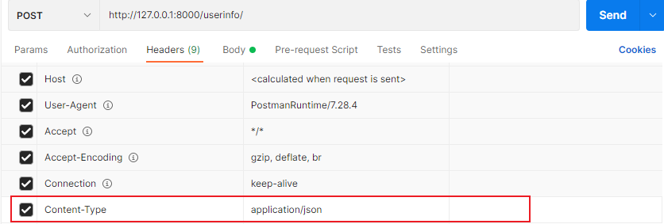
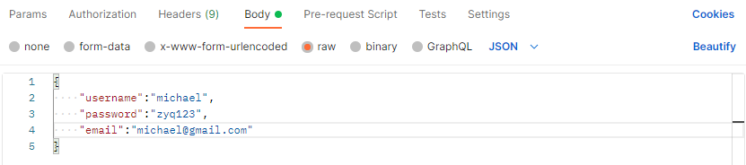

# 后端服务构建


**环境**: Django Restful Framework

## 操作说明

### 1. 安装

```bash
pip install -r requirements.txt
```

### 2. 运行服务器

```bash
python manage.py runserver
```

运行结束后回显示server的ip地址

## 接口测试

**测试工具**：Postman

### 1. 查寻数据

GET /

- 可以看到所有的数据库信息

    [http://127.0.0.1:8000/userinfo](#http://127.0.0.1:8000/userinfo)

- 查询id=3的人员信息

    [http://127.0.0.1:8000/userinfo/3](http://127.0.0.1:8000/userinfo/3):

- 查询username=Michael&email=michael@163.com的人员信息

    [http://127.0.0.1:8000/userinfo/?username=Michael&email=michael@163.com](http://127.0.0.1:8000/userinfo/?username=Michael&email=michael@163.com)

### 2. 添加or修改

POST /

- 添加

    [http://127.0.0.1:8000/userinfo/](http://127.0.0.1:8000/userinfo/)

    Headers按照图添加：

    

    Body按照图选择，添加你想要添加的用户
    填入`usernamne`、`email`、`password`

    

- 修改id=3的人员

    [http://127.0.0.1:8000/userinfo/3/](http://127.0.0.1:8000/userinfo/3/)

    填入`usernamne`、`email`、`password`

### 3. 删除

DELETE /

- 删除id=3的人员

    url直接填入： [http://127.0.0.1:8000/userinfo/3/](http://127.0.0.1:8000/userinfo/3/)并执行就能删除
